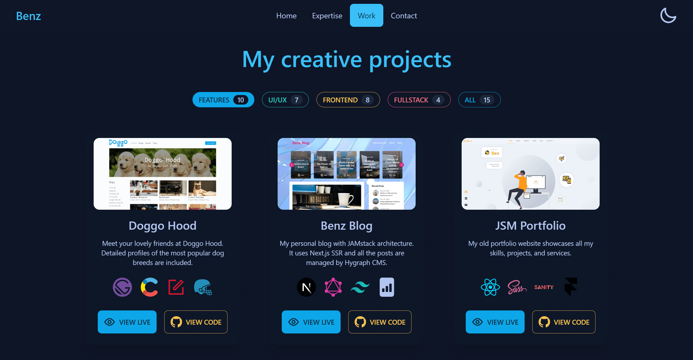

# Benz Portfolio

[View Live Site](https://benz-tran-tech.vercel.app/)

My new unique personal portfolio website. I started this project from scratch and did everything by myself from choosing the technologies to designing, developing and deploying.

## Preview

&nbsp;
&nbsp;

## Tech stack

- [SvelteKit](https://kit.svelte.dev/)
- [Hygraph CMS](https://hygraph.com/)
- [DaisyUI](https://daisyui.com/)
- [GraphQL](https://graphql.org/)
- [Tailwind CSS](https://tailwindcss.com/)
- [Iconify](https://iconify.design/)
- [Vite](https://vitejs.dev/)
- [Vite Imagetools](https://github.com/JonasKruckenberg/imagetools)

## Show your support

Give a ⭐️ if you like this project!
